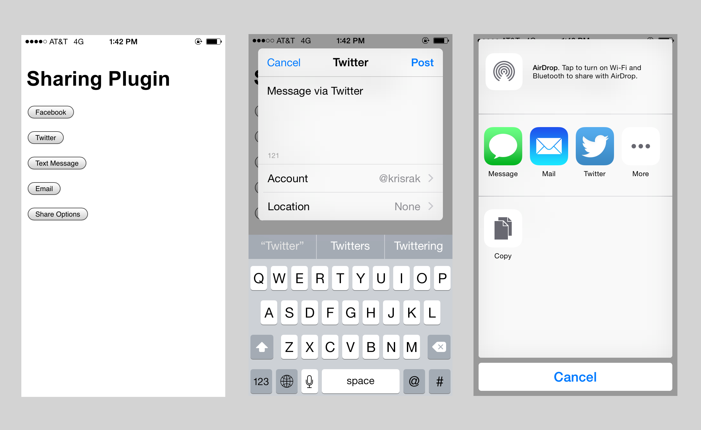

Cordova Social Sharing
======================

Use the [Cordova social sharing plugin by Eddy
Verbruggen](https://github.com/EddyVerbruggen/SocialSharing-PhoneGap-Plugin) to
“share” with other apps such as Facebook\*, Twitter\*, SMS, email and other
popular device apps.

This app can be built for iOS, Android or Windows using the [Intel
XDK](http://xdk.intel.com).

Sharing causes native controls to appear, without having to leave the sample
app. Use the “share options” button to show a view of all sharing options
supported by this plugin that are available on the device.

An additional plugin named `cordova-plugin-queries-schemes` is included as part
of the sample to allow sharing to most popular apps when using iOS 9 devices,
since additional permissions are required on that platform. [See that plugin’s
documentation](https://github.com/rjhilgefort/cordova-plugin-queries-schemes)
and `plugin.xml` file for additional details and information.

 
